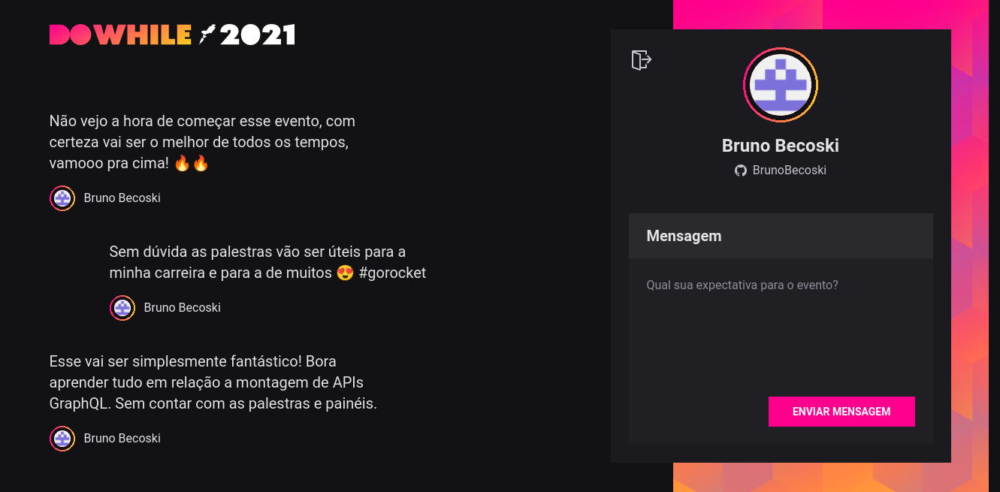
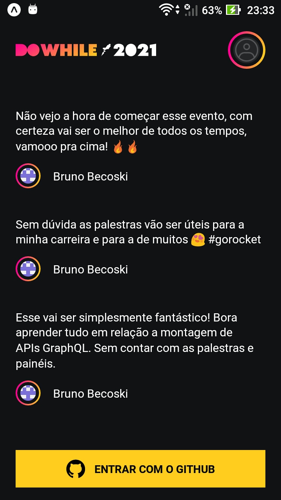
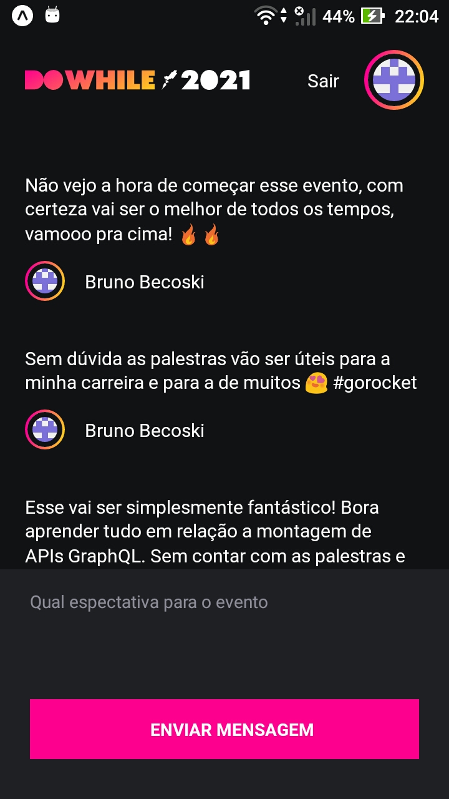

  

 
 

  <a href="#sobre">Sobre</a>&nbsp;&nbsp;&nbsp;|&nbsp;&nbsp;&nbsp;
  <a href="#node">Node.js</a>&nbsp;&nbsp;&nbsp;|&nbsp;&nbsp;&nbsp;
  <a href="#react">React JS</a>&nbsp;&nbsp;&nbsp;|&nbsp;&nbsp;&nbsp;
  <a href="#native">React Native</a>&nbsp;&nbsp;&nbsp;|&nbsp;&nbsp;&nbsp;
  <a href="#elixir">Elixir</a>

 
 

  
  &nbsp;&nbsp;&nbsp;&nbsp;&nbsp;&nbsp;&nbsp;&nbsp; 
  
  &nbsp;&nbsp;&nbsp;&nbsp;&nbsp;&nbsp;&nbsp;&nbsp; 
  
  &nbsp;&nbsp;&nbsp;&nbsp;&nbsp;&nbsp;&nbsp;&nbsp; 
  

 

  

 

## Sobre
O DoWhile 2021 é um app onde as pessoas podem escrever, ou ver as expectativa para o evento DoWhile, desenvolvido durante a NLW#7 Heat - Impulse da Rocketseat entre os dias 18 e 22 de Outubro 2021. 

 

## Node
Back-end da aplicação, utilizando o Prisma como ORM e o SQLite como banco de dados.

### Rotas
/authenticate                            | /profile                         | /messages                          | /messages/last3
---------------------------------------- | -------------------------------- | ---------------------------------- | ----------------------------------------
Cria o usuário ou faz login na aplicação | Retorna as informação do usuário | Salva a mensagem no banco de dados | Retorna as três últimas mensagens salvas
                           

### Tecnologias
* [Node.js](https://nodejs.org/en/)
* [Prisma](https://www.prisma.io)
* [TypeScript](https://www.typescriptlang.org)
* [SQLite](https://www.sqlite.org)
* [Express](https://expressjs.com)
* [Github OAuth](https://docs.github.com/en/developers/apps/building-oauth-apps/authorizing-oauth-apps)
* [Socket.IO](https://socket.io)

 

## React
Front-end web da aplicação, criado com o Vite.

### Design

  
  

  
### Tecnologias
* [React JS](https://reactjs.org)
* [Vite](https://vitejs.dev)
* [TypeScript](https://www.typescriptlang.orgs)
* [Sass](https://sass-lang.com)
* [Socket.IO](https://socket.io)

 

## Native
Front-end mobile da aplicação, criado com o Expo.

### Design

  
  

  
### Tecnologias
* [React Native](https://reactnative.dev)
* [Expo](https://expo.dev)
* [TypeScript](https://www.typescriptlang.org)
* [Moti](https://moti.fyi)
* [Socket.IO](https://socket.io)

 

## Elixir
Microserviço em Elixir, criado com o Phoenix Framework.

Todo dia gera uma nuvem de tags das mensagens enviadas nas últimas 24 horas.

### Tecnologias
* Phoenix
* Ecto
* Task
* Quantum
