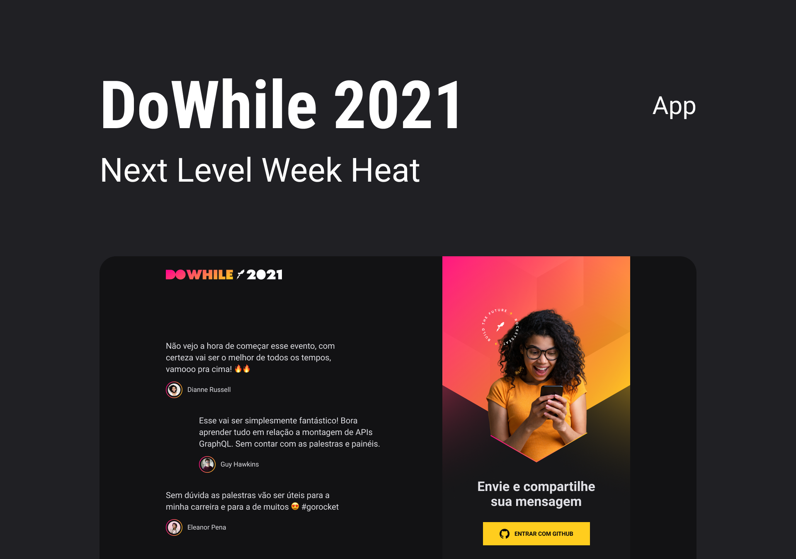

  

 

  <a href="#-sobre">Sobre</a>&nbsp;&nbsp;&nbsp;|&nbsp;&nbsp;&nbsp;
  <a href="#-node.js">Node.js</a>&nbsp;&nbsp;&nbsp;|&nbsp;&nbsp;&nbsp;
  <a href="#-react js">React JS</a>&nbsp;&nbsp;&nbsp;|&nbsp;&nbsp;&nbsp;
  <a href="#-react native">React Native</a>&nbsp;&nbsp;&nbsp;|&nbsp;&nbsp;&nbsp;
  <a href="#-elixir">Elixir</a>

 
 

  

 

## 📖 Sobre
O DoWhile 2021 é um app onde as pessoas podem escrever, ou ver as expectativa para o evento DoWhile, desenvolvido durante a NLW#7 Heat - Impulse da Rocketseat entre os dias 18 e 22 de Outubro 2021. 

 

## Node.js
* Prisma
* TypeScript
* Express
* Github OAuth
* Socket.IO

 

## React JS
* Vite
* TypeScript
* Sass
* Socket.IO

 

## React Native
* Expo
* TypeScript
* Moti
* Socket.IO

 

## 💧 Elixir
* Phoenix
* Ecto
* Task
* Quantum
